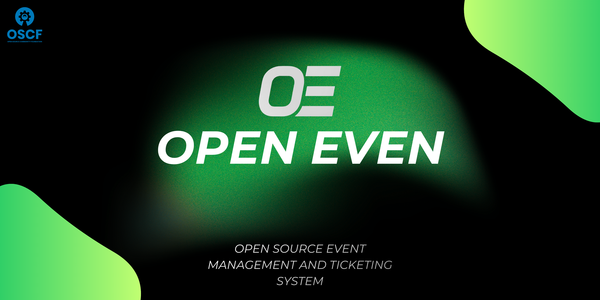

# OPEN EVEN — Open Source Event & Ticketing System

<div align="center">
  

  <p align="center">
    <strong>The ultimate open-source solution for modern event management</strong>
  </p>

  [](https://astro.build/)
  [](https://reactjs.org/)
  [](https://firebase.google.com/)
  [](https://www.typescriptlang.org/)
  [](https://tailwindcss.com/)
</div>

---

## 🌟 What is OPEN EVEN?

**OPEN EVEN** is a high-performance, developer-first event management and ticketing platform. Built with modern web technologies, it provides everything you need to host community meetups, tech conferences, or large-scale festivals with ease.

From beautiful landing pages to real-time QR check-ins, OPEN EVEN is designed to be fast, secure, and infinitely customizable.

---

## ⚡ Key Features

### 💎 Premium User Experience
*   **Modern Landing Pages**: Blazing fast, SEO-optimized pages built with Astro.
*   **Intuitive Ticketing**: Multi-tier ticket categories with customizable limits.
*   **Digital Wallet**: Users can manage, download, and view their passes in a sleek dashboard.
*   **Automated Emails**: Beautiful, branded ticket emails with PDF attachments and calendar invites.

### 🛡️ Powerful Admin Engine
*   **Centralized Command**: Monitor registrations, revenue, and attendance in real-time.
*   **Sales Insights**: Detailed transaction logs and payment verification (Razorpay integrated).
*   **Attendee Moderation**: Full control over user data, role assignments, and ticket issuance.
*   **Content Management**: Manage speakers, sessions, and event schedules dynamically.

### 📱 Volunteer & Field Tools
*   **SwiftCheck-in**: Integrated QR scanner for instant attendee verification.
*   **Live Attendance Stats**: Monitor crowd flow and volunteer performance on the fly.

---

## 🛠️ The Tech Stack

*   **Core**: [Astro](https://astro.build/) + [React](https://reactjs.org/)
*   **Styling**: [Tailwind CSS](https://tailwindcss.com/) + [Framer Motion](https://www.framer.com/motion/)
*   **Backend**: [Firebase](https://firebase.google.com/) (Auth, Firestore, Hosting)
*   **Payments**: [Razorpay](https://razorpay.com/)
*   **Email**: [Brevo](https://brevo.com/) (Transactional SMTP)
*   **Ticket Gen**: [jsPDF](https://github.com/parallax/jsPDF)

---

## 🚀 Quick Start

### 1. Clone the Repo
```bash
git clone https://github.com/yourusername/OPEN-EVEN.git
cd OPEN-EVEN
```

### 2. Install Dependencies
```bash
npm install
```

### 3. Configure Environment
Rename `.env.example` to `.env` and fill in your credentials:
```env
# Firebase
PUBLIC_FIREBASE_API_KEY=
PUBLIC_FIREBASE_AUTH_DOMAIN=
PUBLIC_FIREBASE_PROJECT_ID=
PUBLIC_FIREBASE_STORAGE_BUCKET=
PUBLIC_FIREBASE_MESSAGING_SENDER_ID=
PUBLIC_FIREBASE_APP_ID=

# Brevo (Mailing)
BREVO_API_KEY=

# Razorpay
PUBLIC_RAZORPAY_KEY_ID=
RAZORPAY_KEY_SECRET=
```

### 4. Ignite the Engine
```bash
npm run dev
```

---

## 🤝 Contributing

We love open source! Feel free to fork, open issues, and submit PRs to make OPEN EVEN even better.

---

## 📄 License

This project is licensed under the MIT License - see the [LICENSE](LICENSE) file for details.

---

<div align="center">
  Built with 💚 for the Open Source Community.
</div>
